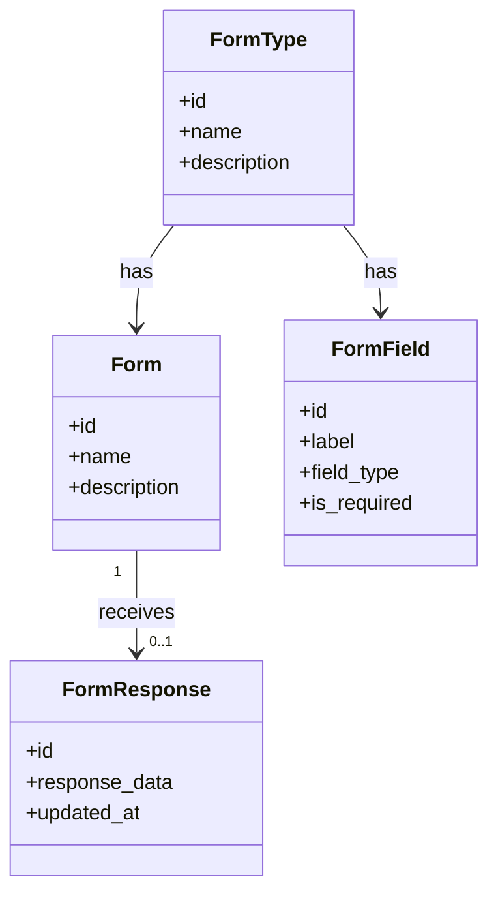
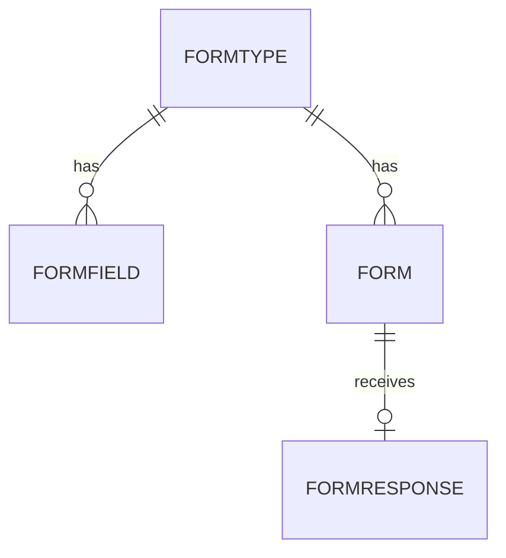

# Modelo de datos de Tandem

## 1. Propósito

Este documento describe el modelo de datos lógico de **Tandem**: una aplicación abierta (sin cuentas de usuario) para crear formularios configurables, compartirlos para que cualquiera los rellene, y consultar las respuestas recibidas. El objetivo es ofrecer una base clara para el diseño de la base de datos, la API y la experiencia de usuario.

> Nota: este modelo es una propuesta inicial de arquitectura de dominio para el MVP y puede evolucionar hacia un diseño más fino según la complejidad funcional real.

---

## 2. Principios del modelo

- Un tipo de formulario (`FormType`) define, mediante una lista ordenada de campos configurables (tipo de dato, obligatoriedad, opciones), la estructura de datos que deben cumplir todos los formularios creados a partir de él.
- Un formulario (`Form`) es una instancia de un `FormType`: hereda sus campos, de modo que se pueden crear varios formularios del mismo tipo sin tener que volver a definir la estructura cada vez.
- Un formulario admite como máximo una respuesta (`FormResponse`): no es una herramienta de encuestas para recoger una respuesta por cada persona que lo rellena, sino un formulario de recogida puntual de información sobre una funcionalidad. Esa respuesta se puede guardar de forma incremental (sin completarla toda de una vez) y editar tantas veces como haga falta después del primer guardado.
- No existe concepto de usuario ni de autenticación: cualquiera con acceso a la aplicación puede crear tipos de formulario, formularios, rellenarlos y consultar sus respuestas.
- El modelo es intencionadamente plano y mínimo: no hay autoría, permisos, ni flujos de revisión o aprobación.

---

## 3. Entidades principales

### 3.1 FormType
Representa un tipo de formulario reutilizable: define los campos que deben rellenar todos los formularios creados a partir de él.

| Propiedad | Tipo | Descripción |
|-----------|------|-------------|
| id | ULID | Identificador único |
| name | String | Nombre del tipo de formulario |
| description | String (nullable) | Descripción del tipo de formulario |
| created_at | Timestamp | Fecha de creación |
| updated_at | Timestamp | Fecha de actualización |

Propósito:
- Agrupar los campos (`FormField`) que definen la estructura de datos a recoger.
- Agrupar los formularios (`Form`) creados a partir de él, para que todos compartan la misma estructura sin redefinirla.

### 3.2 Form
Representa un formulario concreto, creado a partir de un `FormType`, que se comparte para que cualquiera lo rellene.

| Propiedad | Tipo | Descripción |
|-----------|------|-------------|
| id | ULID | Identificador único |
| form_type_id | ULID | Tipo de formulario del que hereda los campos |
| name | String | Nombre del formulario |
| description | String (nullable) | Descripción del formulario |
| created_at | Timestamp | Fecha de creación |
| updated_at | Timestamp | Fecha de actualización |

Propósito:
- Ser la instancia concreta que se comparte para recibir una respuesta, reutilizando los campos definidos en su `FormType`.
- Recibir, como máximo, una respuesta (`FormResponse`).

### 3.3 FormField
Representa un campo individual configurado dentro de un tipo de formulario.

| Propiedad | Tipo | Descripción |
|-----------|------|-------------|
| id | ULID | Identificador único |
| form_type_id | ULID | Tipo de formulario contenedor |
| label | String | Etiqueta del campo |
| field_type | Enum(text, textarea, number, boolean, select, multi_select, date) | Tipo de dato del campo |
| is_required | Boolean | Si el campo es obligatorio para poder enviar la respuesta |
| options | JSON (nullable) | Opciones disponibles para campos `select` o `multi_select` |
| order_index | Integer | Orden de presentación dentro del tipo de formulario |
| created_at | Timestamp | Fecha de creación |
| updated_at | Timestamp | Fecha de actualización |

Propósito:
- Definir los campos, tipo de dato y obligatoriedad de un tipo de formulario.
- Servir de esquema para renderizar cualquier `Form` de ese `FormType` y para validar el `response_data` de sus respuestas.

### 3.4 FormResponse
Representa un envío de respuestas a un formulario.

| Propiedad | Tipo | Descripción |
|-----------|------|-------------|
| id | ULID | Identificador único |
| form_id | ULID | Formulario respondido (único: un Form admite como máximo una FormResponse) |
| response_data | JSON | Valores guardados, indexados por `field_id`; puede estar incompleto mientras el campo `is_required` no tenga valor todavía |
| created_at | Timestamp | Fecha del primer guardado |
| updated_at | Timestamp | Fecha de la última edición |

Propósito:
- Capturar y mantener actualizados los valores de los campos del `FormType` del formulario, permitiendo guardarlos de forma incremental y editarlos después.
- Permitir consultar y revisar la respuesta recibida por un formulario.

---

## 4. Relaciones principales

- Un FormType tiene muchos FormFields.
- Un FormType tiene muchos Forms.
- Un Form tiene como máximo una FormResponse (relación 1:0..1).

---

## 5. Reglas de negocio clave

1. Un FormResponse se puede guardar de forma incremental: no es necesario rellenar todos los campos en un único guardado. Los campos con `is_required = true` deben tener valor para que la respuesta se considere completa.
2. Un Form tiene como máximo una FormResponse: los sucesivos guardados actualizan esa misma respuesta (no se crean filas nuevas) y sus valores se pueden seguir editando en cualquier momento, incluso una vez completa.
3. No existen restricciones de acceso: cualquiera puede crear, editar y eliminar tipos de formulario, campos y formularios, y cualquiera puede rellenar, editar y consultar la respuesta de un formulario.

---

## 6. Diagrama conceptual del dominio

---

## 7. Diagrama entidad-relación lógico

---

## 8. Propuesta de estructura de tablas

Aunque la implementación exacta dependerá de la tecnología elegida, este es un esquema lógico recomendado:

- form_types
- form_fields
- forms
- form_responses

Cada tabla debe incluir:
- id
- created_at
- updated_at
- deleted_at (si se implementa soft delete)

En `form_responses`, `form_id` lleva una restricción de unicidad: un `form` admite como máximo una fila asociada.

---

## 9. Consideraciones de implementación

### 9.1 MVP recomendado
Para el MVP, conviene priorizar las cuatro entidades descritas: form_types, form_fields, forms, form_responses.

### 9.2 Evolución futura
En fases posteriores se podrían añadir:
- Cuentas de usuario y autenticación, si se necesita restringir quién crea tipos de formulario o formularios, o quién ve las respuestas.
- Estados de publicación del formulario (borrador, publicado, cerrado) para controlar cuándo acepta respuestas.
- Lógica condicional entre campos (mostrar/ocultar campos según respuestas previas).
- Exportación de respuestas (CSV, XLSX).
- Analítica y agregación de respuestas (gráficos, resúmenes).
- Permitir múltiples respuestas por formulario (modo encuesta), si en el futuro se necesita ese caso de uso además de la recogida puntual de información del MVP.

---

## 10. Conclusión

El modelo de datos propuesto reduce Tandem a lo mínimo indispensable de una aplicación de creación de formularios: tipos de formulario reutilizables que definen los campos, formularios creados a partir de ellos sin redefinir esa estructura, y la respuesta (como máximo una por formulario) que reciben — sin cuentas de usuario ni control de acceso.
