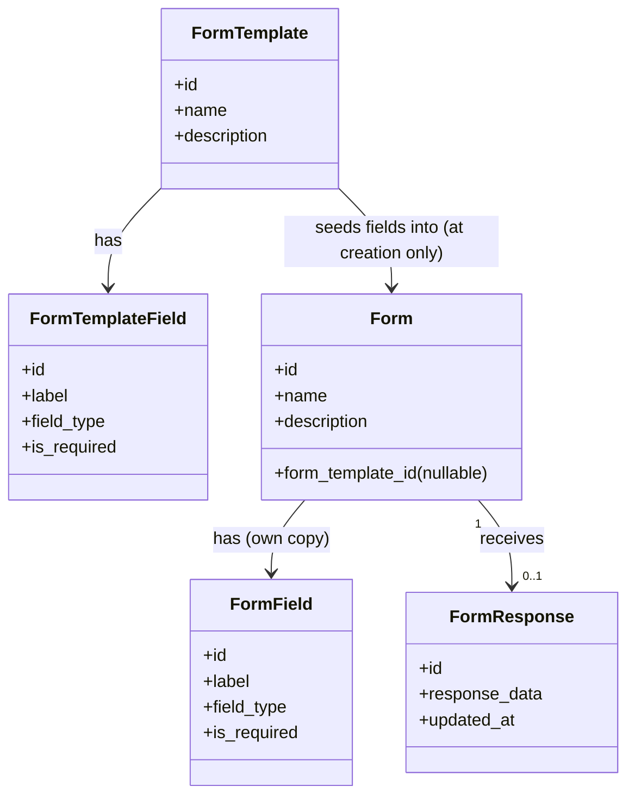
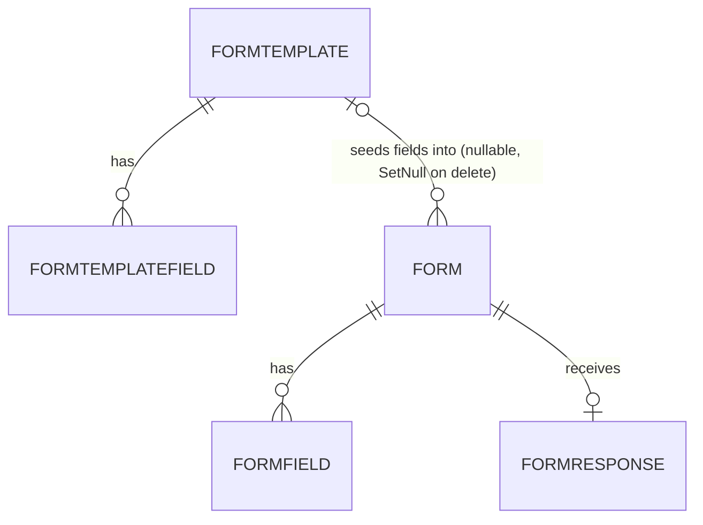

# Modelo de datos de Tandem

## 1. Propósito

Este documento describe el modelo de datos lógico de **Tandem**: una aplicación abierta (sin cuentas de usuario) para crear formularios configurables, compartirlos para que cualquiera los rellene, y consultar las respuestas recibidas. El objetivo es ofrecer una base clara para el diseño de la base de datos, la API y la experiencia de usuario.

> Nota: este modelo es una propuesta inicial de arquitectura de dominio para el MVP y puede evolucionar hacia un diseño más fino según la complejidad funcional real.

---

## 2. Principios del modelo

- Una plantilla de formulario (`FormTemplate`) define, mediante una lista ordenada de campos configurables (tipo de dato, obligatoriedad, opciones), la estructura de datos recomendada para los formularios que se creen a partir de ella.
- Un formulario (`Form`) se crea a partir de una `FormTemplate`: en el momento de la creación, copia los campos de la plantilla como `FormField`s propios. A partir de ahí el formulario es independiente: editar o eliminar los campos de la plantilla, o incluso eliminar la propia plantilla, no afecta a los formularios ya creados ni a sus respuestas.
- Un formulario admite como máximo una respuesta (`FormResponse`): no es una herramienta de encuestas para recoger una respuesta por cada persona que lo rellena, sino un formulario de recogida puntual de información sobre una funcionalidad. Esa respuesta se puede guardar de forma incremental (sin completarla toda de una vez) y editar tantas veces como haga falta después del primer guardado.
- No existe concepto de usuario ni de autenticación: cualquiera con acceso a la aplicación puede crear plantillas de formulario, formularios, rellenarlos y consultar sus respuestas.
- El modelo es intencionadamente plano y mínimo: no hay autoría, permisos, ni flujos de revisión o aprobación.

---

## 3. Entidades principales

### 3.1 FormTemplate
Representa una plantilla de formulario reutilizable: define, mediante sus `FormTemplateField`s, la estructura de campos recomendada para los formularios que se creen a partir de ella.

| Propiedad | Tipo | Descripción |
|-----------|------|-------------|
| id | ULID | Identificador único |
| name | String | Nombre de la plantilla |
| description | String (nullable) | Descripción de la plantilla |
| created_at | Timestamp | Fecha de creación |
| updated_at | Timestamp | Fecha de actualización |

Propósito:
- Agrupar los campos (`FormTemplateField`) que sirven de punto de partida para los formularios creados a partir de ella.
- Servir de fuente para copiar campos en el momento de crear un `Form`; no tiene ninguna relación viva con los formularios ya creados.

### 3.2 FormTemplateField
Representa un campo individual configurado dentro de una plantilla de formulario.

| Propiedad | Tipo | Descripción |
|-----------|------|-------------|
| id | ULID | Identificador único |
| form_template_id | ULID | Plantilla contenedora |
| label | String | Etiqueta del campo |
| field_type | Enum(text, textarea, number, boolean, select, multi_select, date) | Tipo de dato del campo |
| is_required | Boolean | Si el campo es obligatorio para poder enviar la respuesta |
| options | JSON (nullable) | Opciones disponibles para campos `select` o `multi_select` |
| order_index | Integer | Orden de presentación dentro de la plantilla |
| created_at | Timestamp | Fecha de creación |
| updated_at | Timestamp | Fecha de actualización |

Propósito:
- Definir los campos, tipo de dato y obligatoriedad de una plantilla.
- Servir de blueprint que se copia sobre cada `Form` nuevo creado a partir de la plantilla, en el momento de su creación.

### 3.3 Form
Representa un formulario concreto, creado a partir de una `FormTemplate`, que se comparte para que cualquiera lo rellene.

| Propiedad | Tipo | Descripción |
|-----------|------|-------------|
| id | ULID | Identificador único |
| form_template_id | ULID (nullable) | Plantilla de la que se creó el formulario; queda a `null` si esa plantilla se elimina después |
| name | String | Nombre del formulario |
| description | String (nullable) | Descripción del formulario |
| created_at | Timestamp | Fecha de creación |
| updated_at | Timestamp | Fecha de actualización |

Propósito:
- Ser la instancia concreta que se comparte para recibir una respuesta, con sus propios `FormField`s copiados de la `FormTemplate` en el momento de su creación.
- Recibir, como máximo, una respuesta (`FormResponse`).
- Seguir funcionando de forma autónoma aunque su `FormTemplate` de origen cambie o se elimine después.

### 3.4 FormField
Representa un campo individual perteneciente a un formulario concreto, copiado de la plantilla en el momento de crear el formulario.

| Propiedad | Tipo | Descripción |
|-----------|------|-------------|
| id | ULID | Identificador único (distinto del `FormTemplateField` del que se copió) |
| form_id | ULID | Formulario contenedor |
| label | String | Etiqueta del campo |
| field_type | Enum(text, textarea, number, boolean, select, multi_select, date) | Tipo de dato del campo |
| is_required | Boolean | Si el campo es obligatorio para poder enviar la respuesta |
| options | JSON (nullable) | Opciones disponibles para campos `select` o `multi_select` |
| order_index | Integer | Orden de presentación dentro del formulario |
| created_at | Timestamp | Fecha de creación |
| updated_at | Timestamp | Fecha de actualización |

Propósito:
- Definir los campos, tipo de dato y obligatoriedad de un formulario concreto, de forma independiente de su plantilla de origen.
- Servir de esquema para renderizar el `Form` al que pertenece y para validar el `response_data` de su respuesta.

### 3.5 FormResponse
Representa un envío de respuestas a un formulario.

| Propiedad | Tipo | Descripción |
|-----------|------|-------------|
| id | ULID | Identificador único |
| form_id | ULID | Formulario respondido (único: un Form admite como máximo una FormResponse) |
| response_data | JSON | Valores guardados, indexados por `field_id`; puede estar incompleto mientras el campo `is_required` no tenga valor todavía |
| created_at | Timestamp | Fecha del primer guardado |
| updated_at | Timestamp | Fecha de la última edición |

Propósito:
- Capturar y mantener actualizados los valores de los `FormField`s propios del formulario, permitiendo guardarlos de forma incremental y editarlos después.
- Permitir consultar y revisar la respuesta recibida por un formulario.

---

## 4. Relaciones principales

- Una FormTemplate tiene muchos FormTemplateFields.
- Una FormTemplate tiene muchos Forms (a través de `form_template_id`, opcional).
- Un Form tiene muchos FormFields propios, copiados de su FormTemplate en el momento de su creación.
- Un Form tiene como máximo una FormResponse (relación 1:0..1).

---

## 5. Reglas de negocio clave

1. Un FormResponse se puede guardar de forma incremental: no es necesario rellenar todos los campos en un único guardado. Los campos con `is_required = true` deben tener valor para que la respuesta se considere completa.
2. Un Form tiene como máximo una FormResponse: los sucesivos guardados actualizan esa misma respuesta (no se crean filas nuevas) y sus valores se pueden seguir editando en cualquier momento, incluso una vez completa.
3. Los `FormField`s de un `Form` se copian de su `FormTemplate` únicamente en el momento de crear el formulario: no hay ninguna sincronización posterior. Editar los `FormTemplateField`s de la plantilla, o eliminar la propia plantilla, nunca modifica los formularios ya creados a partir de ella ni sus respuestas guardadas.
4. No existen restricciones de acceso: cualquiera puede crear, editar y eliminar plantillas de formulario, campos y formularios, y cualquiera puede rellenar, editar y consultar la respuesta de un formulario.

---

## 6. Diagrama conceptual del dominio

---

## 7. Diagrama entidad-relación lógico

---

## 8. Propuesta de estructura de tablas

Aunque la implementación exacta dependerá de la tecnología elegida, este es un esquema lógico recomendado:

- form_templates
- form_template_fields
- forms
- form_fields
- form_responses

Cada tabla debe incluir:
- id
- created_at
- updated_at
- deleted_at (si se implementa soft delete)

En `form_responses`, `form_id` lleva una restricción de unicidad: un `form` admite como máximo una fila asociada.

---

## 9. Consideraciones de implementación

### 9.1 MVP recomendado
Para el MVP, conviene priorizar las cinco entidades descritas: form_templates, form_template_fields, forms, form_fields, form_responses.

### 9.2 Evolución futura
En fases posteriores se podrían añadir:
- Cuentas de usuario y autenticación, si se necesita restringir quién crea plantillas de formulario o formularios, o quién ve las respuestas.
- Estados de publicación del formulario (borrador, publicado, cerrado) para controlar cuándo acepta respuestas.
- Lógica condicional entre campos (mostrar/ocultar campos según respuestas previas).
- Exportación de respuestas (CSV, XLSX).
- Analítica y agregación de respuestas (gráficos, resúmenes).
- Permitir múltiples respuestas por formulario (modo encuesta), si en el futuro se necesita ese caso de uso además de la recogida puntual de información del MVP.

---

## 10. Conclusión

El modelo de datos propuesto reduce Tandem a lo mínimo indispensable de una aplicación de creación de formularios: plantillas de formulario reutilizables que definen una estructura de campos de partida, formularios creados a partir de ellas con su propia copia independiente de esos campos, y la respuesta (como máximo una por formulario) que reciben — sin cuentas de usuario ni control de acceso.
