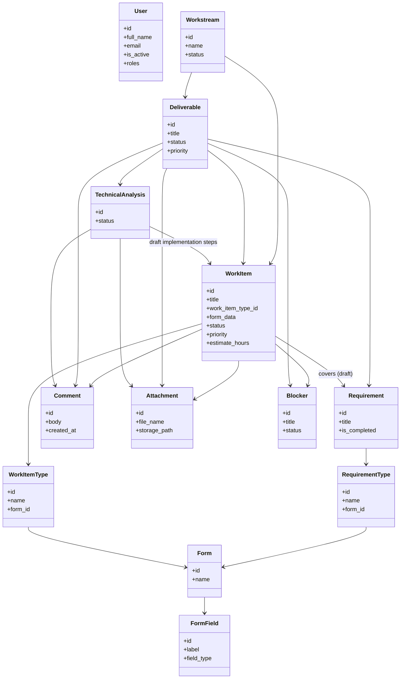
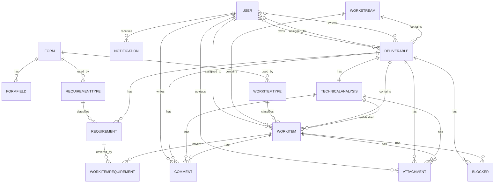

# Modelo de datos de la plataforma de planificación y desarrollo

## 1. Propósito

Este documento describe el modelo de datos lógico de **Tandem** para centralizar la planificación, ejecución y seguimiento del trabajo entre Product Owners, Developers y Team Leads. El objetivo es ofrecer una base clara para el diseño de la base de datos, la API y la experiencia de usuario.

> Nota: este modelo es una propuesta inicial de arquitectura de dominio para el MVP y puede evolucionar hacia un diseño más fino según la complejidad funcional real.

---

## 2. Principios del modelo

- Un único lugar para gestionar el contexto del trabajo: negocio, ejecución y seguimiento.
- Trazabilidad completa entre Workstream, entregable y work item.
- Separación entre la definición del trabajo y su ejecución.
- Registro histórico de cambios y estados para auditoría y colaboración.
- Flexibilidad para capturar requisitos funcionales y work items mediante tipos y formularios configurables.
- Doble validación antes de desarrollo: revisión funcional del Tech Lead y revisión técnica de los reviewers asignados.

---

## 3. Entidades principales

### 3.1 User
Representa una persona que interactúa con la plataforma.

| Propiedad | Tipo | Descripción |
|-----------|------|-------------|
| id | ULID | Identificador único |
| full_name | String | Nombre completo |
| email | String | Correo electrónico |
| roles | Array<Enum(admin, product_owner, developer, team_lead)> | Roles del usuario |
| created_at | Timestamp | Fecha de creación |
| updated_at | Timestamp | Fecha de actualización |

Propósito:
- Identificar a los actores del sistema
- Autorizar acciones según los valores del enum `roles` que tenga asignados el usuario (los permisos se derivan directamente de esos valores, sin una entidad de roles independiente); un usuario puede combinar varios roles (por ejemplo, `product_owner` y `team_lead`) y acumula los permisos de todos ellos
- Asignar responsables, revisores y autores de cambios

### 3.2 Workstream
Representa un contenedor de nivel superior para agrupar trabajo relacionado: una épica, una agrupación de tareas (por ejemplo, "Mejoras menores") o una agrupación de bugs (por ejemplo, "Bugs Q2 2026").

| Propiedad | Tipo | Descripción |
|-----------|------|-------------|
| id | ULID | Identificador único |
| name | String | Nombre del workstream |
| description | String (nullable) | Descripción del workstream |
| status | Enum(planning, active, on_hold, completed, cancelled) | Estado actual del workstream |
| created_at | Timestamp | Fecha de creación |
| updated_at | Timestamp | Fecha de actualización |

Propósito:
- Organizar el trabajo de alto nivel
- Servir de contenedor de entregables
- Servir de contenedor directo de work items
- Proporcionar un contexto de negocio para seguimiento

### 3.3 Deliverable
Representa un entregable de negocio o técnico con alcance, prioridad y estado claro.

| Propiedad | Tipo | Descripción |
|-----------|------|-------------|
| id | ULID | Identificador único |
| workstream_id | ULID | Workstream contenedor |
| title | String | Título del entregable |
| description | String (nullable) | Descripción detallada |
| owner_ids | Array<ULID> | IDs de los Product Owners responsables del entregable |
| assignee_ids | Array<ULID> | IDs de los Developers asignados para el análisis técnico y la implementación |
| reviewer_ids | Array<ULID> | IDs de los reviewers asignados a la revisión del análisis técnico |
| status | Enum(draft, ready_for_review, blocked, ready_for_development, in_technical_analysis, in_progress, done, cancelled) | Estado actual del entregable |
| priority | Enum(low, medium, high, critical) | Prioridad |
| approved_by_lead_id | ULID (nullable) | ID del Tech Lead que aprobó el paso a `ready_for_development` |
| approved_at | Timestamp (nullable) | Fecha de aprobación funcional |
| start_date | Date (nullable) | Fecha de inicio |
| target_date | Date (nullable) | Fecha objetivo |
| created_at | Timestamp | Fecha de creación |
| updated_at | Timestamp | Fecha de actualización |

Propósito:
- Convertir ideas en resultados concretos
- Definir el alcance inicial mediante requisitos funcionales y su estado de avance a lo largo de la revisión funcional y el análisis técnico
- Servir de contenedor de requisitos funcionales, de la revisión técnica y de los work items resultantes
- Actuar como unidad de hito (milestone) en la vista de roadmap

### 3.4 Requirement
Representa un requisito funcional concreto dentro de un entregable. Su estructura de captura depende del tipo de requisito (`RequirementType`) elegido y del formulario asociado a ese tipo.

| Propiedad | Tipo | Descripción |
|-----------|------|-------------|
| id | ULID | Identificador único |
| deliverable_id | ULID | Entregable contenedor |
| requirement_type_id | ULID | Tipo de requisito, determina el formulario a completar |
| title | String | Título del requisito |
| form_data | JSON | Valores introducidos por el Product Owner según los campos del formulario asociado al tipo |
| is_completed | Boolean | Si el requisito está completamente definido |
| order_index | Integer | Orden de presentación |
| created_at | Timestamp | Fecha de creación |
| updated_at | Timestamp | Fecha de actualización |

Propósito:
- Capturar el contenido funcional de un entregable de forma estructurada y configurable
- Bloquear el paso del entregable a `ready_for_review` mientras existan requisitos no completados

### 3.5 RequirementType
Representa un tipo de requisito funcional configurable (por ejemplo: historia de usuario, regla de negocio, requisito no funcional).

| Propiedad | Tipo | Descripción |
|-----------|------|-------------|
| id | ULID | Identificador único |
| name | String | Nombre del tipo de requisito |
| description | String (nullable) | Descripción del tipo de requisito |
| form_id | ULID | Formulario asociado que determina los campos a completar |
| created_at | Timestamp | Fecha de creación |
| updated_at | Timestamp | Fecha de actualización |

Propósito:
- Definir los tipos de requisito disponibles al crear requisitos funcionales en un entregable
- Asociar cada tipo a un formulario que determina su estructura de captura

### 3.6 Form
Representa un formulario configurable utilizado para capturar el contenido de un requisito funcional o de un work item.

| Propiedad | Tipo | Descripción |
|-----------|------|-------------|
| id | ULID | Identificador único |
| name | String | Nombre del formulario |
| description | String (nullable) | Descripción del formulario |
| created_at | Timestamp | Fecha de creación |
| updated_at | Timestamp | Fecha de actualización |

Propósito:
- Definir de forma reutilizable la estructura de campos que debe completar el Product Owner o el Developer para un tipo de requisito o de work item
- Poder asociarse a uno o varios `RequirementType` y/o `WorkItemType` indistintamente

### 3.7 FormField
Representa un campo individual configurado dentro de un formulario.

| Propiedad | Tipo | Descripción |
|-----------|------|-------------|
| id | ULID | Identificador único |
| form_id | ULID | Formulario contenedor |
| label | String | Etiqueta del campo |
| field_type | Enum(text, textarea, number, boolean, select, multi_select, date, user_reference) | Tipo de dato del campo |
| is_required | Boolean | Si el campo es obligatorio para considerar el requisito o work item completo |
| options | JSON (nullable) | Opciones disponibles para campos `select` o `multi_select` |
| order_index | Integer | Orden de presentación |
| created_at | Timestamp | Fecha de creación |

Propósito:
- Definir los campos, tipo de dato y obligatoriedad de un formulario
- Servir de esquema para interpretar y validar el `form_data` de los Requirements o WorkItems de ese tipo

### 3.8 TechnicalAnalysis
Representa el análisis técnico elaborado por los developers asignados a un entregable, previo a la creación de los work items. Tiene una relación 1:1 con el entregable.

| Propiedad | Tipo | Descripción |
|-----------|------|-------------|
| id | ULID | Identificador único |
| deliverable_id | ULID | Entregable al que pertenece |
| content | String | Contenido del análisis técnico |
| status | Enum(draft, in_review, approved, changes_requested) | Estado de la revisión |
| submitted_by_id | ULID (nullable) | Developer que envió el análisis a revisión |
| submitted_at | Timestamp (nullable) | Fecha de envío a revisión |
| reviewed_by_id | ULID (nullable) | Reviewer que aprobó o solicitó cambios |
| reviewed_at | Timestamp (nullable) | Fecha de la última revisión |
| created_at | Timestamp | Fecha de creación |
| updated_at | Timestamp | Fecha de actualización |

Propósito:
- Documentar la viabilidad técnica de un entregable antes de iniciar el desarrollo
- Soportar el ciclo de aprobación o solicitud de cambios por parte de los reviewers asignados al entregable
- Componerse de los WorkItems en estado `draft` que representan los implementation steps necesarios para cumplir los Requirements del entregable
- Habilitar el paso de esos WorkItems a `to_do` únicamente cuando su estado pasa a `approved`

### 3.9 WorkItemType
Representa un tipo de work item configurable (por ejemplo: tarea técnica, bug, spike, tarea de infraestructura).

| Propiedad | Tipo | Descripción |
|-----------|------|-------------|
| id | ULID | Identificador único |
| name | String | Nombre del tipo de work item |
| description | String (nullable) | Descripción del tipo de work item |
| form_id | ULID | Formulario asociado que determina los campos a completar |
| created_at | Timestamp | Fecha de creación |
| updated_at | Timestamp | Fecha de actualización |

Propósito:
- Definir los tipos de work item disponibles al crear tareas dentro de un Deliverable o de un Workstream
- Asociar cada tipo a un Form (el mismo mecanismo reutilizable que emplean los `RequirementType`) que determina su estructura de captura

### 3.10 WorkItem
Es la unidad ejecutable de trabajo: tarea técnica, bug, etc. Pertenece exactamente a un Deliverable o directamente a un Workstream. Su estructura de captura depende del tipo de work item (`WorkItemType`) elegido y del formulario asociado a ese tipo.

| Propiedad | Tipo | Descripción |
|-----------|------|-------------|
| id | ULID | Identificador único |
| deliverable_id | ULID (nullable) | Entregable contenedor |
| workstream_id | ULID (nullable) | Workstream contenedor |
| work_item_type_id | ULID | Tipo de work item, determina el formulario a completar |
| title | String | Título del trabajo |
| form_data | JSON | Valores introducidos según los campos del formulario asociado al tipo (p. ej. descripción, criterios de aceptación, definición de hecho) |
| status | Enum(draft, to_do, in_progress, blocked, done) | Estado actual del flujo |
| priority | Enum(low, medium, high, critical) | Prioridad |
| assignee_id | ULID (nullable) | ID del asignado |
| reviewer_id | ULID (nullable) | ID del revisor |
| estimate_hours | Float | Horas estimadas |
| logged_hours | Float | Horas registradas |
| created_at | Timestamp | Fecha de creación |
| updated_at | Timestamp | Fecha de actualización |

Propósito:
- Gestionar trabajo operativo diario
- Permitir seguimiento por tablero Kanban
- Capturar su contenido de forma estructurada y configurable según su `WorkItemType`, igual que ocurre con Requirement
- Registrar progreso y evidencias; los bloqueos se reflejan mediante el status `blocked` y las entidades Blocker asociadas
- En estado `draft`, representar un implementation step del TechnicalAnalysis del Deliverable, vinculado a uno o varios Requirements mediante `WorkItemRequirement`

### 3.11 WorkItemRequirement
Representa la relación muchos-a-muchos entre un WorkItem en estado `draft` (implementation step) y los Requirements del entregable que ese WorkItem cubre.

| Propiedad | Tipo | Descripción |
|-----------|------|-------------|
| id | ULID | Identificador único |
| work_item_id | ULID | WorkItem asociado |
| requirement_id | ULID | Requirement cubierto por el WorkItem |
| created_at | Timestamp | Fecha de creación |

Propósito:
- Trazar qué Requirements quedan cubiertos por cada implementation step del análisis técnico
- Garantizar que todo WorkItem creado como parte de un TechnicalAnalysis tiene al menos un Requirement asociado

### 3.12 Comment
Permite registrar conversaciones y contexto en entregables, análisis técnicos o tareas.

| Propiedad | Tipo | Descripción |
|-----------|------|-------------|
| id | ULID | Identificador único |
| entity_type | Enum(deliverable, technical_analysis, work_item) | Tipo de entidad comentada |
| entity_id | ULID | ID de la entidad comentada |
| author_id | ULID | ID del autor del comentario |
| body | String | Contenido del comentario |
| created_at | Timestamp | Fecha de creación |

Propósito:
- Mantener historia de decisiones y aclaraciones (por ejemplo, las dudas del Tech Lead al bloquear un entregable, o el feedback de un reviewer sobre el análisis técnico)
- Reducir pérdida de contexto

### 3.13 Attachment
Representa archivos asociados a un elemento del sistema.

| Propiedad | Tipo | Descripción |
|-----------|------|-------------|
| id | ULID | Identificador único |
| entity_type | Enum(deliverable, technical_analysis, work_item) | Tipo de entidad asociada |
| entity_id | ULID | ID de la entidad |
| file_name | String | Nombre del archivo |
| mime_type | String | Tipo MIME del archivo |
| storage_path | String | Ruta del archivo en almacenamiento |
| uploaded_by_id | ULID | ID del usuario que subió el archivo |
| created_at | Timestamp | Fecha de creación |

Propósito:
- Guardar requisitos, diseños, capturas o evidencia
- Facilitar revisión y trazabilidad

### 3.14 Blocker
Representa un impedimento o riesgo asociado a un entregable o tarea.

| Propiedad | Tipo | Descripción |
|-----------|------|-------------|
| id | ULID | Identificador único |
| entity_type | Enum(deliverable, work_item) | Tipo de entidad asociada |
| entity_id | ULID | ID de la entidad |
| title | String | Título del bloqueador |
| description | String (nullable) | Descripción del impedimento |
| severity | Enum(low, medium, high, critical) | Severidad |
| status | Enum(open, in_progress, resolved, cancelled) | Estado del bloqueador |
| created_at | Timestamp | Fecha de creación |
| resolved_at | Timestamp (nullable) | Fecha de resolución |

Propósito:
- Hacer visible los riesgos de ejecución
- Facilitar seguimiento por parte de líderes y responsables
- Cuando está asociado a un WorkItem y en estado abierto, mantener su status en `blocked`

### 3.15 Notification
Registra eventos relevantes para usuarios.

| Propiedad | Tipo | Descripción |
|-----------|------|-------------|
| id | ULID | Identificador único |
| recipient_id | ULID | Usuario destinatario |
| event_type | String | Tipo de evento (status_changed, assigned, commented) |
| entity_type | Enum(deliverable, technical_analysis, work_item) | Tipo de entidad relacionada |
| entity_id | ULID | ID de la entidad relacionada |
| message | String | Mensaje de notificación |
| is_read | Boolean | Si ya fue leída |
| created_at | Timestamp | Fecha de creación |

Propósito:
- Informar cambios de estado, asignaciones o bloqueos
- Mejorar colaboración y visibilidad

---

## 4. Relaciones principales

- Un Workstream puede tener muchos Deliverables.
- Un Workstream puede tener muchos WorkItems directamente.
- Un Form tiene muchos FormFields.
- Un RequirementType pertenece a un Form; un WorkItemType también pertenece a un Form (varios RequirementTypes y WorkItemTypes pueden compartir el mismo Form).
- Un Deliverable tiene muchos Requirements.
- Un Requirement pertenece a un RequirementType.
- Un WorkItem pertenece a un WorkItemType, que determina el formulario (y por tanto el `form_data`) a completar.
- Un Deliverable tiene una única TechnicalAnalysis.
- Un Deliverable tiene muchos WorkItems. Los creados mientras su TechnicalAnalysis está en curso nacen en estado `draft` (implementation steps del análisis); el resto se crean o transicionan una vez el Deliverable está `in_progress`.
- Un WorkItem en estado `draft` tiene uno o varios Requirements asociados a través de WorkItemRequirement; un Requirement puede estar cubierto por varios WorkItems draft.
- Un WorkItem pertenece exactamente a un Deliverable o a un Workstream, nunca a ambos.
- Un WorkItem puede tener muchos Comments, Attachments y Blockers.
- Un Deliverable y una TechnicalAnalysis también pueden tener muchos Comments y Attachments; un Deliverable también puede tener Blockers.

---

## 5. Reglas de negocio clave

1. Cada WorkItem debe pertenecer exactamente a un Deliverable o a un Workstream, nunca a ambos ni a ninguno.
2. Un Deliverable solo puede pasar a `ready_for_review` cuando todos sus Requirements tienen `is_completed = true`.
3. El paso de un Deliverable a `ready_for_development` solo puede ser realizado por un usuario con rol Tech Lead (`team_lead`), y queda registrado en `approved_by_lead_id`/`approved_at`. Si el Tech Lead tiene dudas, el Deliverable pasa a `blocked` y las dudas quedan registradas como Comments; no existe un estado de rechazo adicional, el Product Owner ajusta y vuelve a enviarlo a revisión.
4. El paso de un Deliverable de `ready_for_development` a `in_technical_analysis` requiere que el Product Owner haya asignado al menos un developer (`assignee_ids`) y un reviewer (`reviewer_ids`).
5. Un Deliverable solo puede pasar a `in_progress` cuando su TechnicalAnalysis asociada está en estado `approved`. La aprobación o solicitud de cambios solo puede ser realizada por un usuario incluido en `reviewer_ids` del entregable.
6. Los WorkItems en estado `draft` de un Deliverable solo pueden crearse mientras su TechnicalAnalysis está en estado `draft`, `in_review` o `changes_requested`; representan los implementation steps necesarios para cumplir los Requirements del entregable.
7. Todo WorkItem en estado `draft` debe tener al menos un Requirement asociado mediante WorkItemRequirement; no puede existir un WorkItem draft sin ningún Requirement vinculado.
8. Cuando el TechnicalAnalysis de un Deliverable pasa a `approved` (y el Deliverable a `in_progress`), todos los WorkItems `draft` de ese Deliverable transicionan automáticamente a `to_do`.
9. Un WorkItem no puede pasar a `done` si quedan FormFields obligatorios (`is_required = true`) de su `WorkItemType` sin completar en su `form_data`.
10. Cuando un WorkItem tiene un Blocker abierto asociado, su status debe reflejarse como `blocked`; al resolverse el Blocker, el status debe pasar al valor que corresponda (p. ej. `in_progress`).
11. Los usuarios solo podrán ver o editar elementos según los permisos asociados a sus roles.
12. Las fechas de inicio y fin (start_date/target_date) solo se gestionan a nivel de Deliverable; Workstream y WorkItem no tienen fechas propias y su planificación temporal se deriva de los entregables que contienen.

---

## 6. Diagrama conceptual del dominio

---

## 7. Diagrama entidad-relación lógico

---

## 8. Propuesta de estructura de tablas

Aunque la implementación exacta dependerá de la tecnología elegida, este es un esquema lógico recomendado:

- users
- workstreams
- deliverables
- requirements
- requirement_types
- forms
- form_fields
- technical_analyses
- work_item_types
- work_items
- work_item_requirements
- comments
- attachments
- blockers
- notifications

Cada tabla debe incluir:
- id
- created_at
- updated_at
- deleted_at (si se implementa soft delete)

---

## 9. Consideraciones de implementación

### 9.1 MVP recomendado
Para el MVP, conviene priorizar:
- users
- workstreams
- deliverables
- requirements
- requirement_types
- forms
- form_fields
- technical_analyses
- work_item_types
- work_items
- work_item_requirements
- comments
- attachments

### 9.2 Evolución futura
En fases posteriores se podrían añadir:
- dependencias entre work items
- automatizaciones de flujo
- métricas y dashboards
- integración con repositorios y CI/CD
- seguimiento de releases y entornos
- permisos más granulares por proyecto o equipo, más allá de los roles globales del usuario
- historial de transiciones de estado de Deliverable, TechnicalAnalysis y WorkItem (auditoría granular)
- versionado del análisis técnico ante sucesivas solicitudes de cambios
- estados de flujo configurables por tipo de work item o equipo, más allá del enum fijo del MVP

---

## 10. Conclusión

El modelo de datos propuesto permite representar de forma consistente el ciclo completo de trabajo, desde la idea inicial hasta la entrega. Su diseño está orientado a maximizar trazabilidad, visibilidad y colaboración entre negocio y desarrollo, mientras ofrece una base sólida para construir la experiencia de producto y la capa de persistencia.
